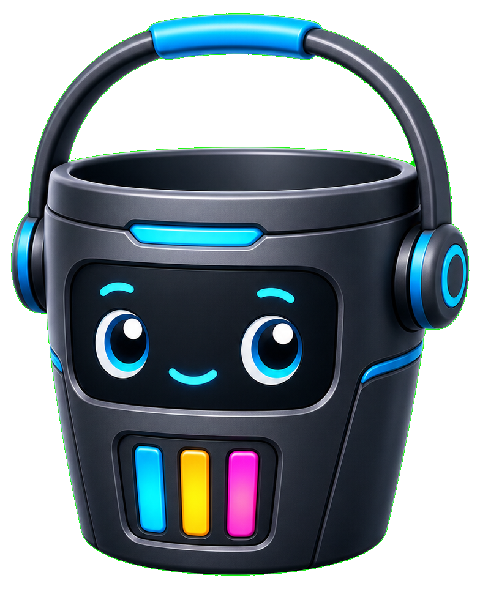
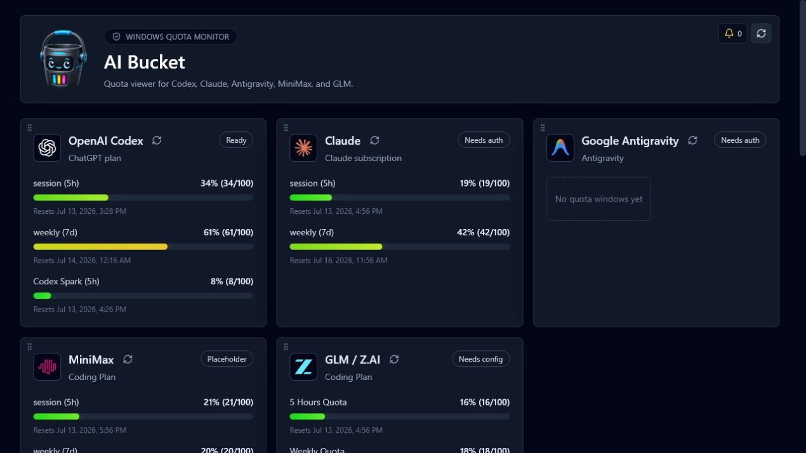

<p align="center">
  
</p>

<h1 align="center">AI Bucket</h1>

<p align="center">
  A local-first Windows dashboard for monitoring AI account quota in one place.
</p>

<p align="center">
  
  
  
  
</p>



AI Bucket is a read-only quota viewer. It collects structured usage data from local signed-in
sessions or provider API keys, normalizes each provider's quota windows, and presents them as
consistent used-percentage gauges. It is not an API gateway and does not need to remain open.

## Highlights

- Monitor OpenAI Codex, Claude, Google Antigravity, MiniMax, and GLM / Z.AI.
- Detect supported local app sessions on first launch and place detected accounts first.
- Add multiple accounts for the same provider, each with a custom label and independent settings.
- Drag cards to reorder them, or hide a card without deleting its configuration.
- Refresh one account or all accounts; optionally auto-refresh every 2 to 60 minutes.
- Notify when usage crosses a configurable threshold or when a quota window appears to reset.
- Avoid repeat notifications for the same provider, window, and percentage during an app session.
- Keep the latest 150 quota records locally, with 15 records per history page.
- Switch between system, dark, and light themes and compact, normal, or large density.
- Restore window position, size, and maximized state across launches.
- Store API keys encrypted with Windows DPAPI and display only a masked value after saving.

## Supported providers

| Provider | Authentication | Quota source |
|---|---|---|
| OpenAI Codex | Existing local Codex CLI session | ChatGPT structured usage endpoint |
| Claude | Existing local Claude Desktop session | Claude structured usage endpoint, including Fable when available |
| Google Antigravity | Existing local Antigravity OAuth session | Antigravity structured quota endpoint |
| MiniMax | API key | Coding Plan or Token Plan quota endpoint |
| GLM / Z.AI | API key | Coding Plan quota endpoint |

Interactive OAuth initiated by AI Bucket is not implemented yet. Current local-session providers
reuse credentials maintained by their official desktop app or CLI. AI Bucket does not scrape
provider web pages.

## Install

Download the latest files from the repository's **Releases** page.

### Windows installer (recommended)

1. Download the file ending in `setup.exe`.
2. Run the installer. It installs for the current Windows user and does not require administrator
   access.
3. Launch **AI Bucket** from the Start menu.

The installer includes Microsoft's WebView2 bootstrapper. On a machine without WebView2, an
internet connection is required once so the bootstrapper can install it. Windows 10 and 11
normally already include WebView2.

### Portable ZIP

1. Download the file ending in `windows-x64-portable.zip`.
2. Extract the ZIP to a normal folder.
3. Run `AI Bucket.exe`.

The portable archive does not bundle a separate browser runtime, keeping the download small. It
uses the system WebView2 runtime. "Portable" describes the executable packaging only: settings,
history, and encrypted credentials are still stored in the current Windows user's AppData folder.
See [Portable build notes](docs/PORTABLE.md).

> Release builds are currently unsigned. Windows SmartScreen may show an unknown-publisher
> warning until the project uses a code-signing certificate.

## First launch

AI Bucket checks for existing Codex CLI, Claude Desktop, and Google Antigravity sessions. Every
detected account is labeled **Local Config** and moved above providers that still need setup.
MiniMax and GLM accounts can be configured by adding their API key under **Accounts and
automation**.

Each account provides separate controls for auto-refresh, quota-threshold alerts, and reset
alerts. A reset is inferred when a window drops from above 10% used to below 5% used between
refreshes. This tolerance allows another client to consume a small amount before AI Bucket checks.

## Privacy and local data

AI Bucket has no project server, telemetry service, or cloud database. Provider requests go
directly from the desktop process to the configured provider endpoint.

Local data is stored under:

```text
%APPDATA%\com.local.ai-bucket\
```

- `ai-bucket.sqlite` contains account settings, normalized quota snapshots, and recent history.
- `credentials\` contains API keys encrypted for the current Windows user with DPAPI.
- Local provider sessions remain owned by the original app or CLI and are read only when needed.

Never attach this AppData directory to a bug report. See [Security policy](SECURITY.md) for safe
reporting guidance.

## Development

Requirements:

- Windows 10 or 11 (x64)
- Node.js 20 or newer
- Rust stable with the `x86_64-pc-windows-msvc` target
- Microsoft C++ Build Tools and Windows SDK
- WebView2 Runtime

```powershell
npm ci
npm run tauri dev
```

### Development modes

Use the command that matches what you are testing:

| Command / executable | What it runs | Terminal behavior |
|---|---|---|
| `npm run dev` | Vite frontend only, using browser-safe mock data | Keep the terminal open for Vite logs and hot reload |
| `npm run tauri dev` | Vite plus the real Rust/Tauri backend | Keep the terminal open for frontend, Rust, and provider errors |
| `src-tauri/target/debug/ai-bucket.exe` | Previously compiled debug app | Requires a Vite server on port `1420`; launching it alone is not a complete dev environment |
| `src-tauri/target/release/ai-bucket.exe` | Self-contained release app with embedded frontend | Opens without a terminal window |

`npm run tauri dev` is the normal development command. It watches frontend files for hot reload
and recompiles the Rust backend when required. The terminal belongs to the development toolchain,
not to the AI Bucket user interface; stop the dev session with `Ctrl+C`. Both debug and release
executables are built as Windows GUI applications, so they do not create a second black console
window of their own.

For UI-only work, open the URL printed by `npm run dev` in a browser. Provider refresh, local
credential detection, native notifications, window-state persistence, and other Tauri commands
must be tested with `npm run tauri dev`.

Useful checks:

```powershell
npm run build
cargo fmt --manifest-path src-tauri/Cargo.toml -- --check
cargo test --manifest-path src-tauri/Cargo.toml
```

Build the installer and release executable locally:

```powershell
npm run tauri build -- --bundles nsis
```

The unsigned installer is written under `src-tauri/target/release/bundle/nsis/`, while the plain
executable is `src-tauri/target/release/ai-bucket.exe`.

## Publishing a release

GitHub Actions validates every push and pull request. Pushing a version tag builds the Windows
installer, creates a portable ZIP, and publishes both files to a GitHub Release:

```powershell
git tag v0.1.2
git push origin v0.1.2
```

Keep the tag aligned with the version in `package.json`, `src-tauri/Cargo.toml`, and
`src-tauri/tauri.conf.json`.

## Reliability notes

Some providers expose quota through undocumented endpoints used by their own clients. Those
endpoints may change without notice. AI Bucket fails closed, validates response shape and size,
and never treats an HTML login page as quota data. This project is not affiliated with OpenAI,
Anthropic, Google, MiniMax, or Zhipu AI.

Provider research and normalized response details live in the
[provider quota knowledgebase](docs/provider-quota-knowledgebase.md).

## License

AI Bucket is released under the [MIT License](LICENSE). See
[Third-Party Notices](THIRD_PARTY_NOTICES.md) for acknowledged upstream research and licenses.
